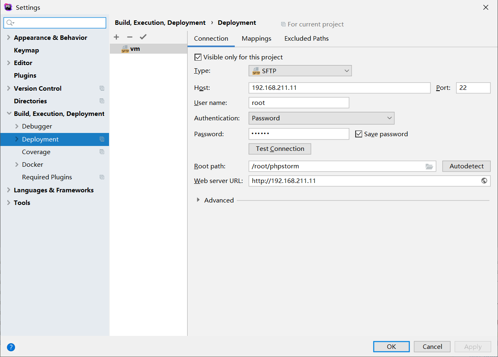
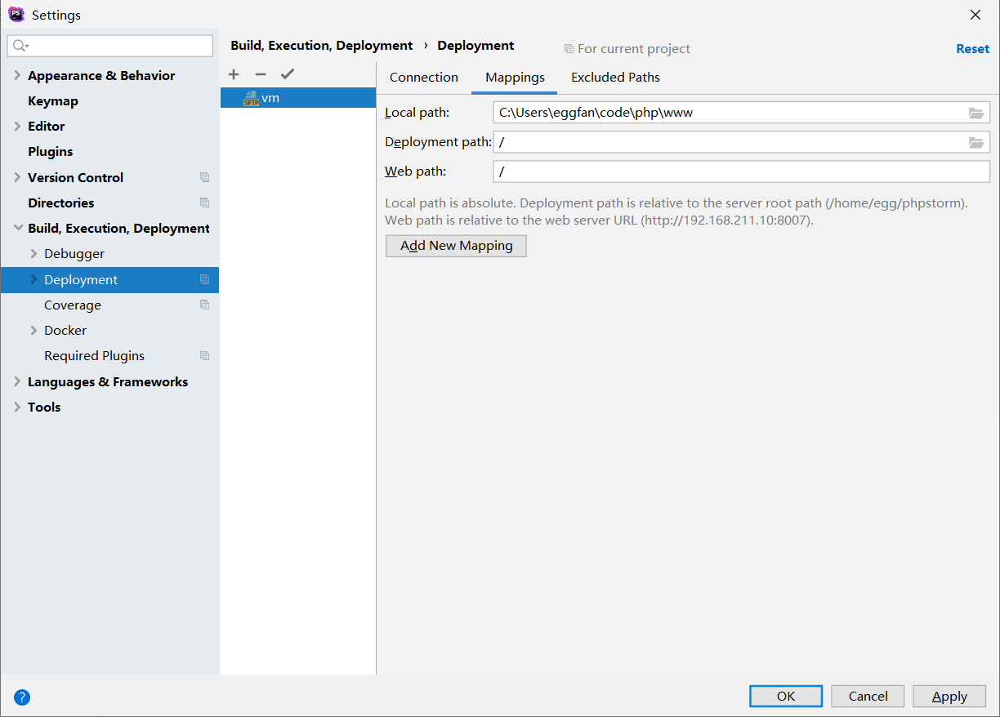
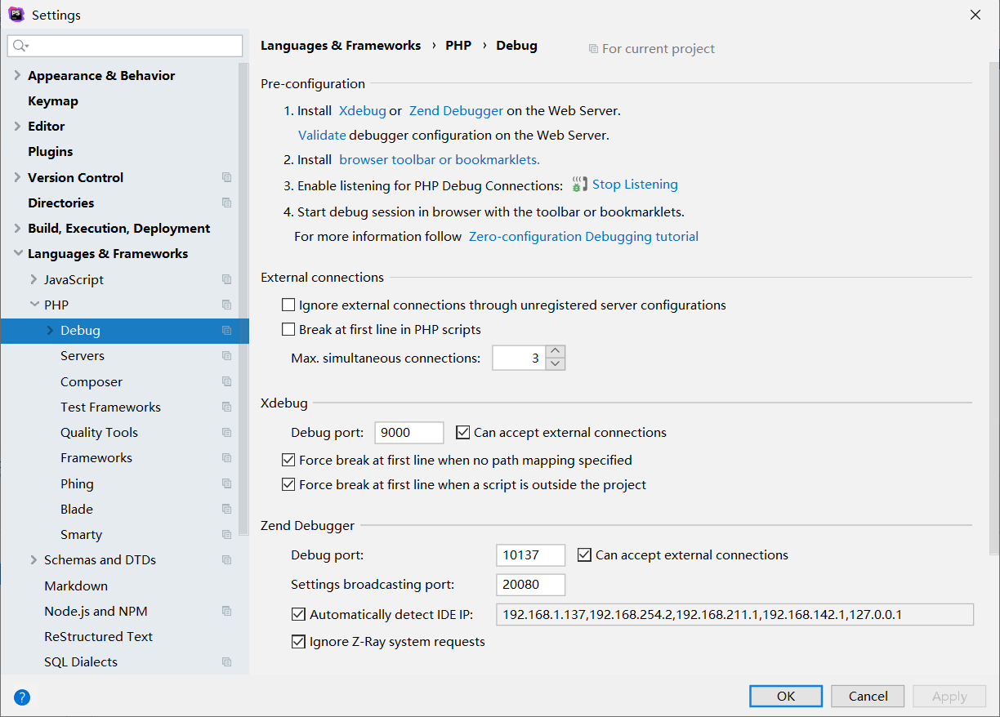
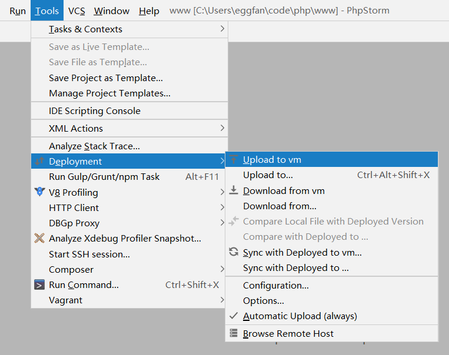
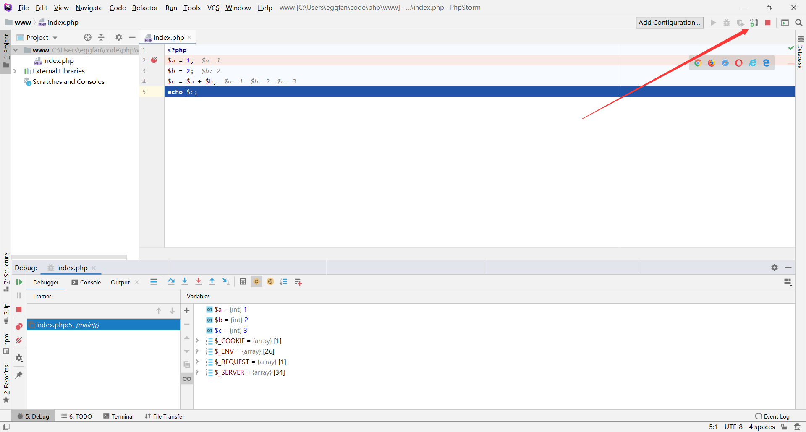

# Windows下PhpStorm + Docker调试环境


每次重装系统都要安装环境，为了方便记录下过程，下次就可以直接copy了 :smile:

我的环境是Windows(192.168.211.1) + PhpStorm + VMware + Ubuntu(192.168.211.11) + Docker

## 构建环境
用以下dockerfile构建镜像，启动容器配置xdebug调试环境

```dockerfile
FROM php:apache
RUN docker-php-ext-install mysqli
RUN pecl install xdebug
RUN docker-php-ext-enable xdebug
```

```shell
$ docker build -t php-debug ./
$ docker run -d -v "$PWD/phpstorm:/var/www/html" -p "80:80" --name phpstorm php-debug
$ docker exec -it phpstorm bash

# debug.remote_host替换为宿主机ip
$ echo -e 'xdebug.remote_enable=On\nxdebug.remote_host=192.168.211.1\nxdebug.remote_port=9000\nxdebug.auto_trace=On\nxdebug.collect_vars=On\nxdebug.collect_return=On\nxdebug.collect_params=On\nxdebug.idekey=phpstorm\nxdebug.remote_log="/tmp/xdebug.log"' >> /usr/local/etc/php/php.ini
$ exit
$ docker restart phpstorm
```

## 配置PhpStorm







## 同步代码并调试



打开phpstorm右上角的debug监听，打开chrome的Xdebug helper插件的debug功能，访问页面即可调试



## 其他

```shell
# 设置原生密码认证，允许root远程访问
$ docker run --name some-mysql -p "3306:3306" -e MYSQL_ROOT_PASSWORD=root -d mysql
$ docker exec -it some-mysql mysql -uroot -p
mysql> grant all privileges on *.*  to 'root'@'%';
mysql> ALTER USER 'root'@'%' IDENTIFIED WITH mysql_native_password BY 'root';
mysql> flush privileges;

# 允许root ssh登录
$ sudo passwd root
$ sudo vim /etc/ssh/sshd_config
#设置PermitRootLogin yes
$ sudo service ssh restart
```

