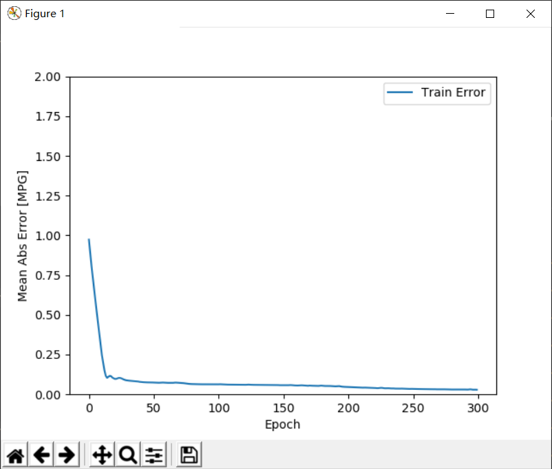
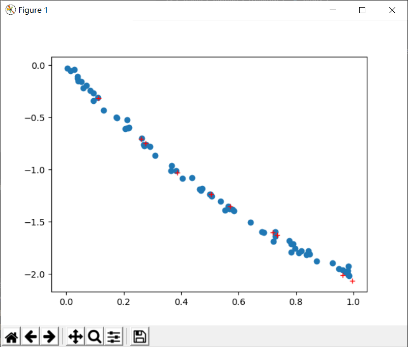
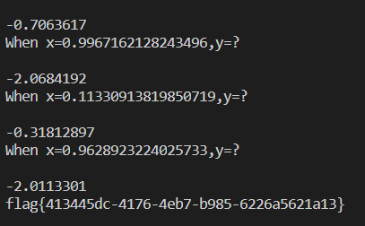

# [V&N2020 公开赛] 记一道MachineLearning题


## 前言

前两天在RoarCTF 交流群里看到腹黑师傅发W&M招新赛的链接，就上去看了看。发现MISC有一道MachineLearning题：`[V&N2020 公开赛]ML 第一步`，碰巧这段时间在搞一个DeepLearning项目，就尝试了一下，第一次做出来DL题。:stuck_out_tongue_winking_eye::stuck_out_tongue_winking_eye::stuck_out_tongue_winking_eye:

## 初探

拿到域名和端口，国际惯例nc上去:smile:

题目意思：给你70组数据，让你预测10组数据，要求loss小于0.06

显然这是个回归（regression）问题，这里我选择tensorflow v2的keras api搭建网络，真香:yum:

```shell
$ nc node3.buuoj.cn 25115
hello,whats your name?
frieggs
hi,frieggs
There is a func and some data to train,please guess my func and answer my question:
When you need help,please take this num to ask for help:1
Now I will give you 70 data:[ENTER]

x=0.23293131229477126,y=-0.6546346007667923;
x=0.9141812803441588,y=-1.923420422937762;
x=0.5978186731303873,y=-1.4330594279625735;
x=0.9081244761918499,y=-1.9252163352184513;
x=0.6397127738411532,y=-1.5098826967326122;
x=0.4126789955389717,y=-1.0610931549067264;
x=0.4723890788951174,y=-1.164921025969659;
x=0.14372339309751103,y=-0.4077362577217497;
x=0.9225541186759473,y=-1.9643974463302152;
x=0.7711563780945728,y=-1.702248722890862;
x=0.2038953054962851,y=-0.5997436441843649;
x=0.6263053110417236,y=-1.4816287831706654;
x=0.32514168647239805,y=-0.8664563573379703;
x=0.6249863260140601,y=-1.4632787128261502;
x=0.2706873892963526,y=-0.667958062941054;
x=0.18529895655996909,y=-0.5153729906817134;
x=0.43797173474171236,y=-1.1505276391445383;
x=0.09206362654732536,y=-0.22902442460467892;
x=0.28674442651700094,y=-0.7568451882263891;
x=0.8473679877638907,y=-1.7847257038214273;
x=0.5199051988574164,y=-1.3132961377962167;
x=0.23662738696874386,y=-0.6775411613309307;
x=0.5105118320718761,y=-1.2921978879411098;
x=0.5022470922340977,y=-1.3112019941405897;
x=0.7752705900700582,y=-1.695869752384335;
x=0.24518941046122678,y=-0.6728831661626552;
x=0.5476635719996427,y=-1.3350604937270167;
x=0.14555038196250714,y=-0.4502351420894147;
x=0.5402691798964878,y=-1.2881121079051063;
x=0.060376524271612886,y=-0.22952293246414246;
x=0.6685815075710536,y=-1.5457709729242959;
x=0.3891074774923087,y=-1.0099949516551094;
x=0.8497091497091634,y=-1.833082162965835;
x=0.5308089077776695,y=-1.3000807761787088;
x=0.5319205111100348,y=-1.3027475694565198;
x=0.7460198741302583,y=-1.6791168349347692;
x=0.4361965526637247,y=-1.0805461179967266;
x=0.8381685198758803,y=-1.802818419639961;
x=0.49170712019766427,y=-1.2995792517865328;
x=0.09375206370396205,y=-0.3210610110426531;
x=0.23191284838776027,y=-0.6098419736980532;
x=0.3861293210803447,y=-1.050336512975188;
x=0.6393526599126003,y=-1.5280334701843157;
x=0.6831673785649255,y=-1.6218118230629652;
x=0.7607856571980453,y=-1.6892705354914876;
x=0.6556675697457789,y=-1.540235578785005;
x=0.25976364113975015,y=-0.672125184716639;
x=0.6126008719466577,y=-1.5310814384436477;
x=0.9694970227101206,y=-1.9325120143495362;
x=0.6949118217585081,y=-1.5717537157195178;
x=0.08188742975790797,y=-0.21082472094809357;
x=0.7870408155959038,y=-1.7347261736185102;
x=0.25292479781129673,y=-0.7236291459828087;
x=0.25519691318721127,y=-0.6465866313592334;
x=0.022113229287526015,y=0.0013596887514838174;
x=0.7467069251250199,y=-1.6701056178020084;
x=0.2420825936331218,y=-0.7123246046772168;
x=0.703562175733554,y=-1.6269793627781495;
x=0.4336818991326158,y=-1.0629238800984522;
x=0.21475120663954939,y=-0.5480934889951207;
x=0.7213355828205726,y=-1.63253228990537;
x=0.7794141621830423,y=-1.755053624663293;
x=0.2777075023004413,y=-0.7901581455824338;
x=0.3568414571627093,y=-0.9602735787303361;
x=0.513602580825322,y=-1.3143973009694436;
x=0.6108141481891833,y=-1.4581997442253065;
x=0.9668204533936676,y=-1.972803885674858;
x=0.7890379052688813,y=-1.8087162106504862;
x=0.5277245729370588,y=-1.308632554138398;
x=0.44539342462609965,y=-1.1234586310392338;
okay,do you guess my func?I will ask you 10 questions.If your loss less than 0.06,i will give you the FLAG[ENTER]

When x=0.5389179669047208,y=?
1
When x=0.4984903405356802,y=?
1
When x=0.8770009254960851,y=?
1
When x=0.45269982284910104,y=?
1
When x=0.6850424168303579,y=?
1
When x=0.6730912681959299,y=?
1
When x=0.928994296997916,y=?
1
When x=0.5356037645753124,y=?
1
When x=0.035392897170888005,y=?
1
When x=0.8092257545967552,y=?
1
NOnono~~~
```

## 脚本

```python
# Auther: frieggs
# Blog: https://blog.frieggs.com

from tensorflow.keras.models import Sequential
from tensorflow.keras.layers import Dense, Activation
from tensorflow import keras
import matplotlib.pyplot as plt
import numpy as np
import pandas as pd
import socket
import re
import time

def getMessage():
    time.sleep(0.1)
    content = s.recv(1024).decode()
    print(content)
    return content

def sendMessage(text=""):
    time.sleep(0.1)
    print(text)
    s.send((str(text) + "\n").encode())

def plot_history(history):
  hist = pd.DataFrame(history.history)
  hist['epoch'] = history.epoch
  plt.figure()
  plt.xlabel('Epoch')
  plt.ylabel('Mean Abs Error [MPG]')
  plt.plot(hist['epoch'], hist['mae'],
           label='Train Error')
  plt.ylim([0,2])
  plt.legend()
  plt.show()

s = socket.socket()
s.connect(('node3.buuoj.cn', 25465))
getMessage()
sendMessage("frieggs")
getMessage()
sendMessage()
content = ''
content += getMessage()
content += getMessage()
content += getMessage()
content += getMessage()
print(content)
x = re.findall(r'x=(.*?),y=.*?;', content)
y = re.findall(r'x=.*?,y=(.*?);', content)
x = [float(i) for i in x]
y = [float(i) for i in y]
X_train = np.array(x)
Y_train = np.array(y)

# 构建一个顺序模型
model = Sequential()

# 在模型中添加64单元的全连接层
model.add(Dense(64, input_shape=(1,)))
# 用relu作为激活函数
model.add(Activation("relu"))

model.add(Dense(64))
model.add(Activation("relu"))

model.add(Dense(1))

'''
编译模型，使用adam加速训练
采用均方误差（Mean Square Error，MSE）作为损失函数训练模型
采用平均绝对误差（Mean Absolute Error，MAE）评价模型
'''
model.compile(optimizer='adam', loss='mse', metrics=['mae'])

# 打印模型结构摘要
print(model.summary())

# 训练300轮
history = model.fit(X_train, Y_train, epochs=300)
# 可视化训练过程
plot_history(history)
sendMessage()
# 记录训练集数据的离散点
plt.scatter(X_train, Y_train)
for i in range(10):
    res = re.findall('When x=(.*?),y=?', getMessage())
    X_p = np.array([float(res[0])])
    # 用X预测Y的值
    Y_p = model.predict(X_p)[0][0]
    sendMessage(Y_p)
    # 红色加号标注预测点
    plt.plot(X_p, Y_p, 'r+')
plt.show()
getMessage()
s.close()

```

## 结果







